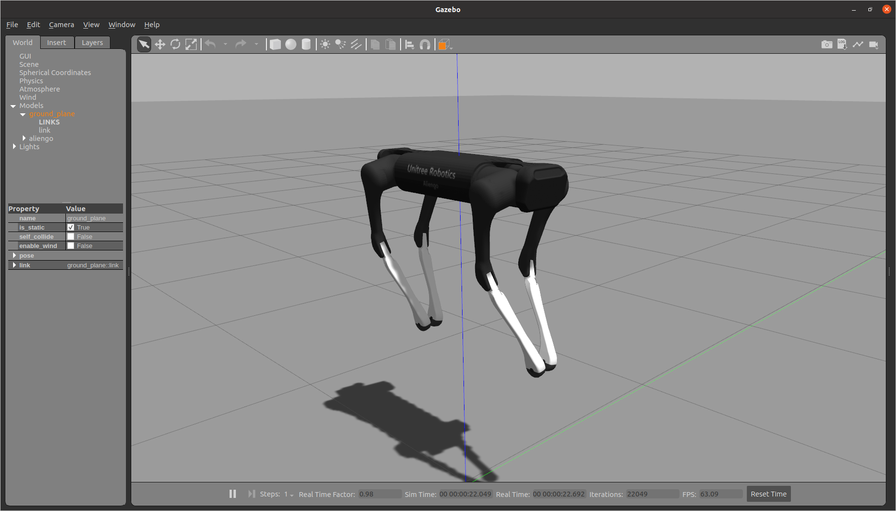
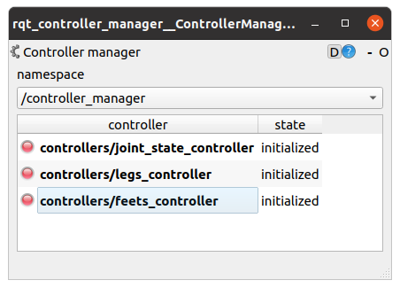
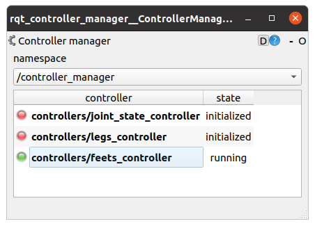
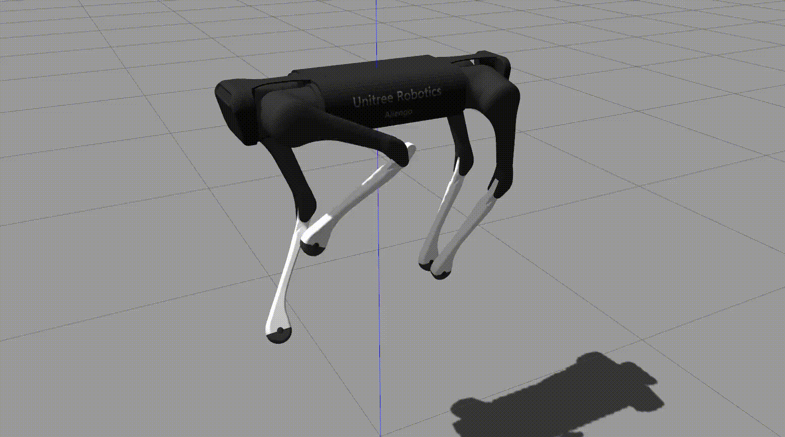

# unitree_ros

## Overview

Unofficial unitree ROS and ros-control interface and some basic controllers (no only for unitree robots, also include
some common quadruped robots)

**Keywords:** example, package, template

### License

The source code is released under a [BSD 3-Clause license](LICENSE).

**Author: QiayuanLiao<br />
Maintainer: QiayuanLiao, liaoqiayuan@gmail.com**

The PACKAGE NAME package has been tested under [ROS] Noetic on respectively Ubuntu 20.04. This is research code, expect
that it changes often and any fitness for a particular purpose is disclaimed.

## Installation

[comment]: <> (### Installation from Packages)

[comment]: <> (To install all packages from the this repository as Debian packages use)

[comment]: <> (    sudo apt-get install ros-noetic-...)

[comment]: <> (Or better, use `rosdep`:)

[comment]: <> (	sudo rosdep install --from-paths src)

### Building from Source

#### Dependencies

- [Robot Operating System (ROS)](http://wiki.ros.org) (middleware for robotics)
- [Eigen3]()
- [pinocchio](https://github.com/stack-of-tasks/pinocchio)

Install all dependence in one command:

    sudo rosdep install --from-paths src

#### Building

To build from source, clone the latest version from this repository into your catkin workspace and compile the package
using

	cd catkin_workspace/src
	git clone git@github.com:qiayuanliao/unitree_ros.git
	cd ../
	rosdep install --from-paths . --ignore-src
	catkin build # or catkin_make

## Usage

### Quick start

Set your robot type(a1 or aliengo) as an environment variable: `ROBOT_TYPE`

    export ROBOT_TYPE=aliengo #export ROBOT_TYPE=a1

Launch the simulation by:

    mon launch unitree_gazebo empty_world.launch hung_up:=true


Load all basic controllers by:

    mon launch unitree_control load_controllers.launch

You can start the controller using `rqt_controller_manager`

    sudo apt install ros-noetic-rqt-controller-manager
    rosrun rqt_controller_manager rqt_controller_manager



Start a controller by right clik and select start.

* Start `joint_state_controller` then you can get the joint states by topic **`/joint_states`**
* If you only what to control the foot position velocity and force in cartesian space by topic **`/cmd_legs`**, start
  the `legs_controller`;
* If you also what to let the foot follow a bezier trajectory by topic **`/cmd_feet`**, start the `feets_controller`
* TODO: Some detail about these controllers

**NOTE: The `legs_controller` and `feet_controller` should not running in the same time!**



After start the controller (for example: `feet_controller`), you can control the leg/legs or foot/feet by sending
message to topic, like the command line code above command FL foot follow a bezier cure with height 0.1 meter and
finally reach the position {x: 0.0, y: 0.0, z: -0.3} in 0.5 second.

```
rostopic pub /cmd_feet unitree_msgs/FeetCmd "header:
  seq: 0
  stamp: {secs: 2, nsecs: 0}
  frame_id: ''
leg_prefix:
- {prefix: 0}
touch_state: [1]
ground_reaction_force:
- {x: 0.0, y: 0.0, z: 0.0}
pos_final:
- {x: 0.0, y: 0.0, z: -0.3}
height: [0.1]
swing_time: [0.5]"
```

You can try other legs and final position or write another node to perform some high level control. **DON'T FORGET TO
UPDATE THE TIME STAMP OF EACH MESSAGE!!! 不要忘记更新每个消息的时间戳！！！**

The gif below shows a loop action command by a simple script.



## Bugs & Feature Requests

Please report bugs and request features using the [Issue Tracker](https://github.com/qiayuanliao/unitree_ros/issues)
.


[ROS]: http://www.ros.org
